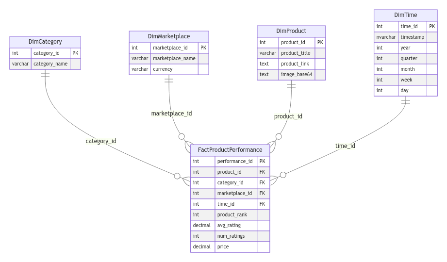
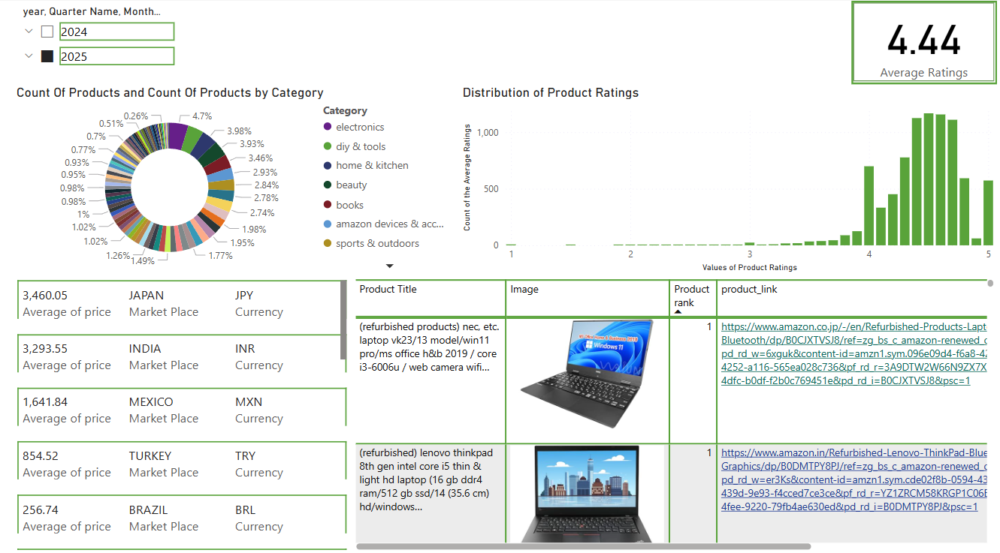
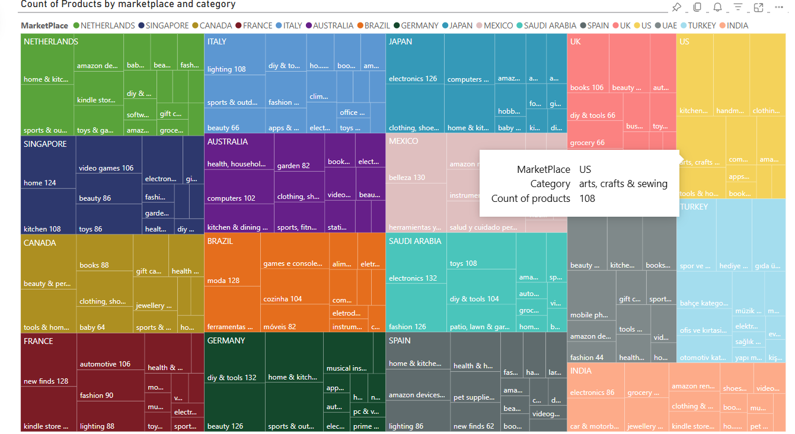
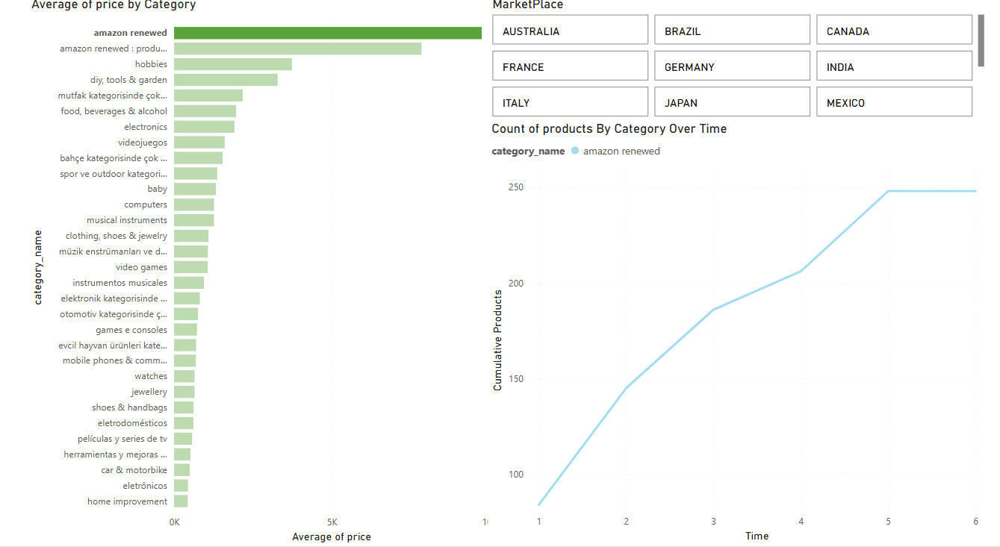
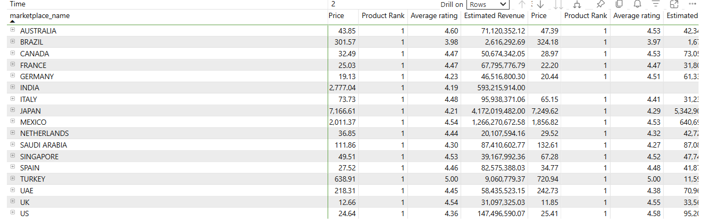
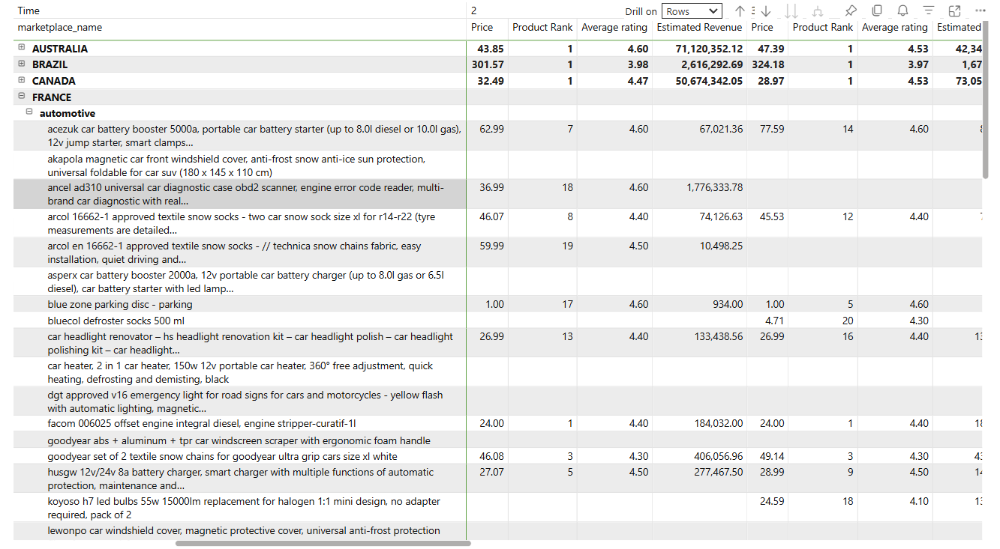

# DataNest - Amazon Best Sellers Analytics Dashboard

## 🚀 Project Overview

This project is an **analytics platform/dashboard** designed to help drop shippers and e-commerce merchants track and analyze **best-selling products** across multiple Amazon marketplaces, including **Amazon US, UK, Canada, and India**.

## 📌 Key Features

- **Automated Data Collection:** Scrapes best-selling products from Amazon's Best Sellers section **on a weekly basis** using **Selenium**.
- **Insights & Trends:** A Power BI dashboard visualizing product rankings, price trends, and customer ratings.
- **Multi-Marketplace Analysis:** Compare best sellers across different Amazon regions.
- **Data Storage:** The structured data is stored in an **Azure SQL Database** for analysis.

## 📂 Repository Structure

```
DataNest/
│── docs/                    # Documentation and images
│── data_samples/            # Sample dataset
│── README.md                # Project overview
```

## 🏛 Data Model Schema

Below is the **data model schema** used to structure the scraped data.



## 📸 Screenshots

---

### 📊 **1. Dashboard Overview: High-Level Insights**  
*Get a quick snapshot of Amazon’s best sellers with interactive filters. This dashboard helps sellers track product rankings, identify top-rated products, and monitor price variations across different marketplaces.*  

*Features: product count by category (donut chart), rating distribution, price comparisons, and an interactive product table with images and links.*  



---

### 🌍 **2. Marketplace Analysis: Regional Dominance**  
*A treemap visualization showcasing best-selling products across Amazon categories and marketplaces. This allows sellers to identify the most profitable product categories in each region.*  

*For example, Electronics dominate Japan, while Automotive products perform best in Germany.*  



---

### 🛒 **3. Category Analysis: Pricing & Trends**  
- Tracks **how categories rotate products** on a **week-to-week basis**.  
- **Key Insights:**  
  - Helps sellers determine whether specific categories remain in the best-sellers list consistently or if the top products change frequently.  
  - Provides insights into whether a category is volatile or stable in terms of product rankings.  
  - Analyzes the **average price of each category** to assist with pricing strategies.
 

    


---

### 📈 **4. Trend Analysis: Marketplace Comparison**  
*Compare key e-commerce metrics across 17 Amazon marketplaces to spot profitable trends and pricing opportunities. This allows sellers to refine their sourcing strategies based on real-time market insights.*  



---

### 🔧 **5. Trend Analysis Example: Automotive Deep Dive**  
*Want to know when to stock up on winter products? This dashboard helps you track seasonality-driven best sellers, ensuring you don’t miss out on high-demand items.*  

*For example, portable car battery boosters and snow socks show significant price and ranking variations while maintaining high and consistent ratings (4.4+).*  



## 🛒 How This Helps Sellers

This dashboard is designed to provide **actionable insights** for e-commerce businesses and drop shippers by offering:

- **Trending Product Identification:** Know which items are rising in demand across different Amazon marketplaces.
- **Pricing Strategies:** Adjust prices dynamically based on historical trends and competitor pricing data.
- **Competitive Analysis:** Compare product rankings, revenue estimates, and ratings to stay ahead of competitors.
- **Inventory Planning:** Track seasonal demand trends and optimize stock levels to maximize sales.

## 📝 Insights & Findings

- Key trends observed from the best-selling products
- How rankings and prices fluctuate over time
- Seasonal trends affecting product categories

## 📌 Why This Project?

By leveraging this dashboard, e-commerce sellers can:

✅ Identify **profitable products** and emerging trends.  
✅ Optimize **pricing strategies** using real-time data.  
✅ Make **data-driven inventory decisions** based on demand.  

This project also showcases my ability to:

✅ Build an **end-to-end data pipeline**  
✅ Work with **web scraping, data engineering, and analytics**  
✅ Create **interactive dashboards for business insights**  

## ⚙️ Tech Stack

- **Programming & Scripting:** Python
- **Database & Storage:** SQL, Azure Data Studio
- **Data Scraping:** Selenium
- **Visualization & Analytics:** Power BI

## 🌐 Connect with Me

If you found this project interesting, let's connect!

📩 [My Linkedin Account](https://www.linkedin.com/in/mohamed-amine-boukriba-16052017a/)  
📧 [My Email Address:boukriba.mohamed.amine@gmail.com](#)  

## ⭐ Give It a Star!

If you like this project, don't forget to **star** this repository! ⭐

